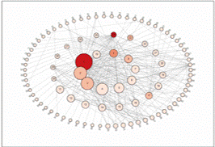
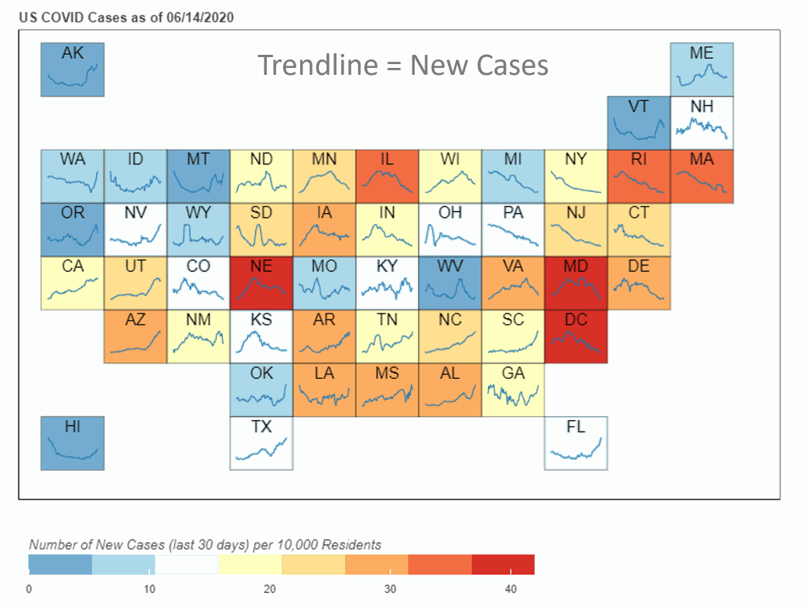
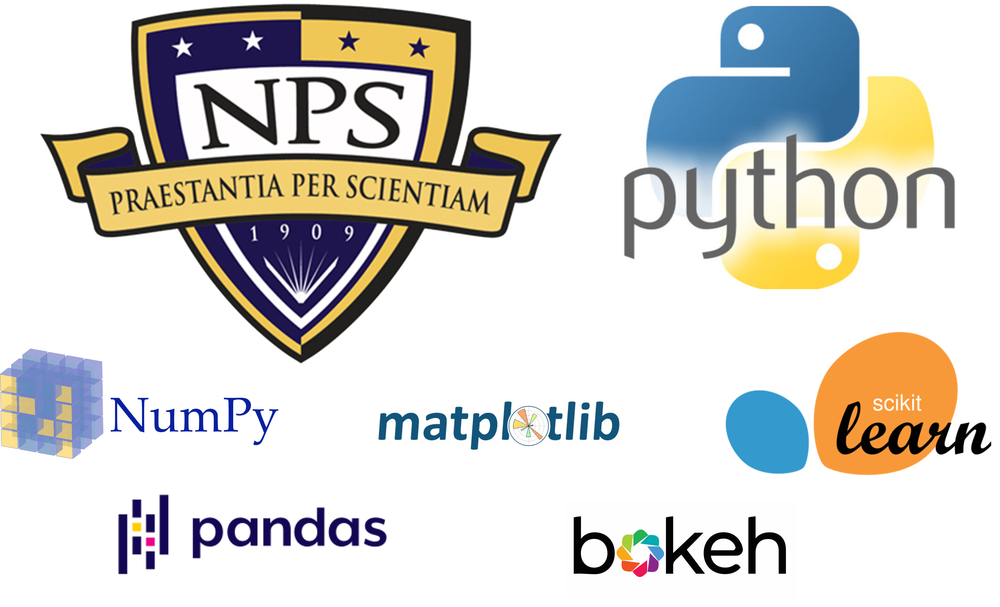

# Matt Smith

### US Army Operations Research Officer

**Interested In:** Data Analysis, AI/ML, Data Visualization, Computer Vision, Decision Support Tools

**Skills:** Python Data Analysis Ecosystem, Web Dashboards, HPC, Leading Data Science Teams 

## Contact Me
- **Email:** mdsmith44@gmail.com
- **Phone:** 617-899-7936
- **LinkedIn:** [https://www.linkedin.com/in/matt-smith-ab569067/](https://www.linkedin.com/in/matt-smith-ab569067/)

## Education

<table>
  <tr>
    <td>PhD, Management Science and Engineering</td>
    <td>Stanford University (<i>2017</i>)</td>
  </tr>
  <tr>
    <td>MS, Electrical Engineering</td>
    <td>University of Southern California (<i>2010</i>)</td>
  </tr>
  <tr>
    <td>BS, Physics</td>
    <td>MIT (<i>2006</i>)</td>
  </tr>
</table>

## Current Job
**Assistant Professor**           
Naval Postgraduate School     
(_June 2023 - present_)
- Military faculty for the Data Analytics curriculum within the Operations Research department. Teaching courses focused on Computational Methods for Data Analytics, Statistical and Machine Learning, and Capstone Projects in Applied Defense Analytics.
- Also serves as technical director for the NPS Data Science and Analytics Group (DSAG), leading education, advisory, and research efforts across campus.

## Projects
### Tactical Network Analysis
Demonstration of tools used to perform data analysis and data visualization of high-throughput tactical networks used in experimentation.

<a href='https://github.com/mdsmith44/Tactical_Network_Analysis/tree/main' target='_blank'>Git repo</a>

View dashboard:

### COVID Trends by State
Overview of COVID trends by state, built with bokeh.

<a href='https://github.com/mdsmith44/py_qrcode_gen' target='_blank'>Git repo</a>

View dashboard:

### Python Data Analysis Bootcamp
A tutorial built designed to cover fundamentals of data anlaysis in Python, assuming no prior background.  Covers python fundamentals, data processing (`numpy` and `pandas`), data visualization (`matplotlib`, `seaborn`, `bokeh`), and machine learning (`sklearn`).  

<a href='https://github.com/mdsmith44/NPS-Python-Primer' target='_blank'>Git repo</a>

### Streamlit App for Generating QR Codes
<a href='https://github.com/mdsmith44/py_qrcode_gen' target='_blank'>Git repo</a>

Sample streamlit dashboard to enable NPS community to build custom QR Codes.

Live app:

