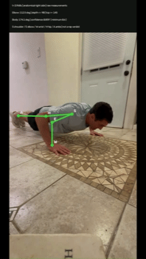
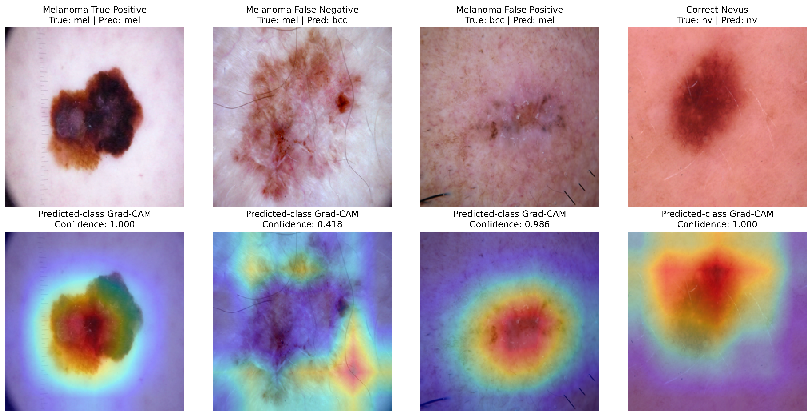
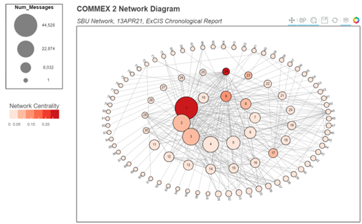
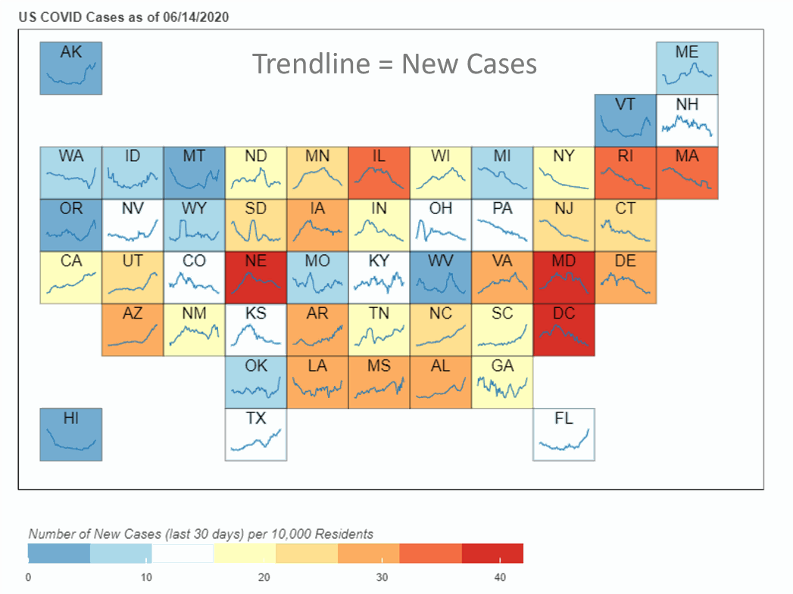
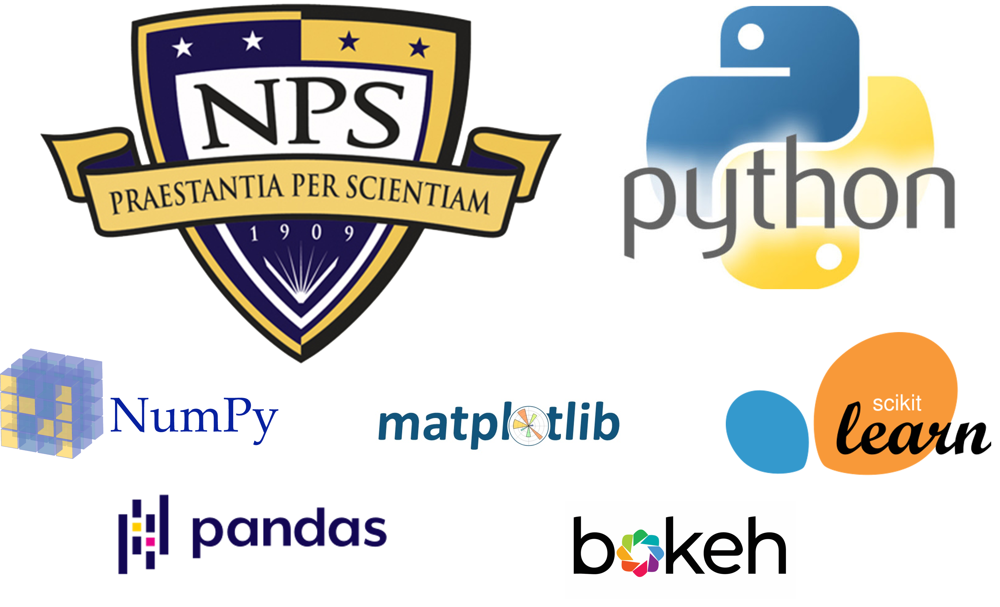

# Matt Smith

### US Army Operations Research Officer

**Interested In:** Data Analysis, AI/ML, Data Visualization, Computer Vision, Decision Support Tools

**Skills:** Python Data Analysis Ecosystem, Web Dashboards, HPC, Leading Data Science Teams 

## Contact Me
- **Email:** mdsmith44@gmail.com
- **Phone:** 617-899-7936
- **LinkedIn:** [https://www.linkedin.com/in/matt-smith-ab569067/](https://www.linkedin.com/in/matt-smith-ab569067/)

## Current Job
**Assistant Professor**           
Naval Postgraduate School     
(_June 2023 - present_)
- Military faculty for the Data Analytics curriculum within the Operations Research department. Teaching courses focused on Computational Methods for Data Analytics, Statistical and Machine Learning, and Capstone Projects in Applied Defense Analytics.
- Also serves as technical director for the NPS Data Science and Analytics Group (DSAG), leading education, advisory, and research efforts across campus.

## Projects
### Pushup Verifier and Counter
Python application that uses MediaPipe and OpenCV to measure joint angles and evaluate pushup sequences from video. The project combines pose estimation, annotated video, and rule-based temporal reasoning, with explicit handling of uncertain or partially blocked observations.

<a href='https://github.com/mdsmith44/pushup-verifier/tree/main' target='_blank'>Git repo</a>

### Skin Lesion Classification and Multimodal AI Deployment
End-to-end computer vision and multimodal AI project using the HAM10000 skin-lesion dataset on NVIDIA GB300 infrastructure. The project combines a fine-tuned ResNet18 classifier, NeMo-based parameter-efficient fine-tuning of SmolVLM, SmolVLM2 visual descriptions, and grounded report generation with NVIDIA Nemotron. The deployment pipeline uses ONNX and TensorRT for optimized GPU inference, with model evaluation, explainability, output validation, and multi-model serving incorporated throughout the workflow.

<a href='https://github.com/mdsmith44/skin-lesion-ai' target='_blank'>Git repo</a>

### Tactical Network Analysis
Demonstration of tools used to perform data analysis and data visualization of high-throughput tactical networks used in experimentation.

<a href='https://github.com/mdsmith44/Tactical_Network_Analysis/tree/main' target='_blank'>Git repo</a> 
<a href='https://github.com/mdsmith44/Tactical_Network_Analysis/blob/main/paper/Smith%20Tactical%20Experiment%20In%20Stride%20Analysis.pdf' target='_blank'>Research Paper: Near Real Time Analytics for Project Convergence 21</a>

View dashboard:

### COVID Trends by State
Overview of COVID trends by state, built with bokeh.

<a href='https://github.com/mdsmith44/py_qrcode_gen' target='_blank'>Git repo</a>

View dashboard:

### Python Data Analysis Bootcamp
A tutorial built designed to cover fundamentals of data anlaysis in Python, assuming no prior background.  Covers python fundamentals, data processing (`numpy` and `pandas`), data visualization (`matplotlib`, `seaborn`, `bokeh`), and machine learning (`sklearn`).  

<a href='https://github.com/mdsmith44/NPS-Python-Primer' target='_blank'>Git repo</a>

### Streamlit App for Generating QR Codes
<a href='https://github.com/mdsmith44/py_qrcode_gen' target='_blank'>Git repo</a>

Sample streamlit dashboard to enable NPS community to build custom QR Codes.

Live app:

